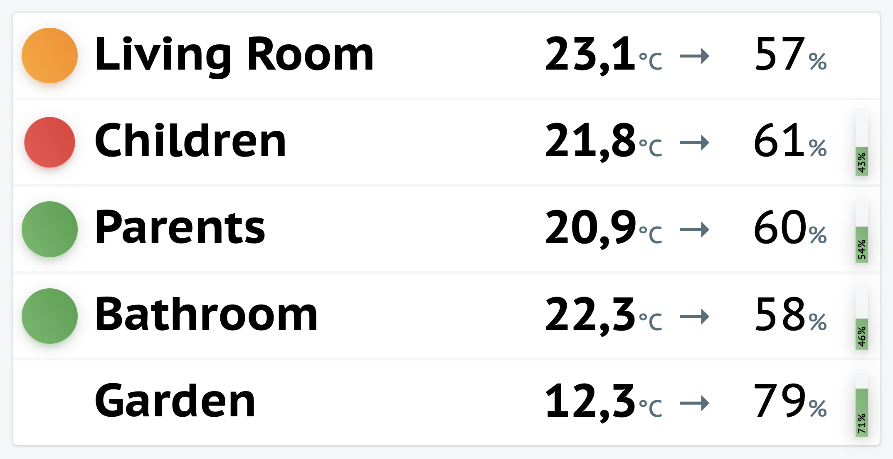

This is a simple viewer for Netatmo module stats for a permanent visible device.



Simply configure `app/config/prod.json` by overwriting it with your Netatmo credentials.

```
{
    "$extends": "local",
    "debug": false,
    "client_id": "your_client_id",
    "client_secret": "your_client_secret",
    "username": "your_username",
    "password": "your_password",
    "stationName": "your_station_name"
}

```

To start it locally simply run `SILEX_ENV=prod php -S 127.0.0.1:8080 -t netatmo-viewer/web/` and open the [Netatmo viewer](http://localhost:8080).
